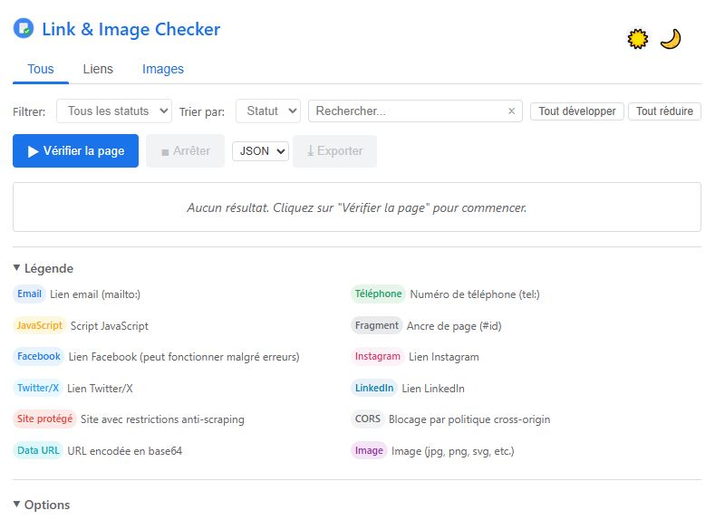

# Link & Image Checker


Extension Chrome pour vérifier les liens brisés et les images manquantes sur une page web.



## 🌟 Caractéristiques

- ✅ **Vérification complète** : Analyse des liens internes, externes et des images
- 🔍 **Détection avancée** : Identification des liens brisés, redirections et problèmes de contenu
- 🚀 **Performance** : Vérifications parallèles avec contrôle de concurrence
- 🛡️ **Cas particuliers** : Gestion intelligente des réseaux sociaux, CORS, et domaines protégés
- 🔄 **Interface interactive** : Filtrage, tri et recherche des résultats en temps réel
- 📊 **Exportation** : Sauvegarde des résultats en JSON, CSV ou HTML
- 🎨 **Design adaptatif** : Support des modes clair et sombre

## 📋 Sommaire

- [Installation](#-installation)
- [Utilisation](#-utilisation)
- [Fonctionnalités](#-fonctionnalités-détaillées)
- [Configuration](#-configuration)
- [Structure du projet](#-structure-du-projet)
- [Contribution](#-contribution)
- [Licence](#-licence)
- [Contact](#-contact)

## 🔧 Installation

### Depuis le Chrome Web Store

1. Visitez [la page de l'extension](https://chrome.google.com/webstore/detail/link-image-checker/XXXXXX) dans le Chrome Web Store
2. Cliquez sur "Ajouter à Chrome"
3. Confirmez l'installation

### Installation manuelle (développeurs)

1. Clonez ce dépôt :
   ```bash
   git clone https://github.com/Artkabis/link-image-checker.git
   ```

2. Ouvrez Chrome et accédez à `chrome://extensions/`

3. Activez le "Mode développeur" (coin supérieur droit)

4. Cliquez sur "Charger l'extension non empaquetée"

5. Sélectionnez le dossier cloné

## 🚀 Utilisation

1. Visitez la page web que vous souhaitez analyser
2. Cliquez sur l'icône de l'extension dans la barre d'outils de Chrome
3. Cliquez sur "Vérifier la page" pour commencer l'analyse
4. Explorez les résultats organisés par catégories :
   - **Verts** : Liens et images fonctionnels
   - **Oranges** : Avertissements et redirections
   - **Rouges** : Erreurs et liens brisés
5. Utilisez les filtres et la recherche pour explorer les résultats
6. Exportez les résultats si nécessaire

## 📊 Fonctionnalités détaillées

### Vérification de liens

- Détection des liens brisés (404, 500, etc.)
- Suivi des redirections avec vérification de la destination finale
- Vérification des ancres internes (#id)
- Gestion spéciale des protocoles particuliers (mailto:, tel:, javascript:)
- Traitement adapté pour les réseaux sociaux et sites protégés

### Vérification d'images

- Détection des images manquantes ou inaccessibles
- Vérification des types MIME
- Support des images d'arrière-plan en CSS
- Gestion des URLs de données (data:)
- Contournement intelligent des restrictions CORS

### Interface utilisateur

- Filtrage par statut (Tous, Erreurs, Avertissements, Réussis)
- Tri par statut, URL ou type
- Recherche en temps réel
- Affichage détaillé des informations pour chaque élément
- Mise en évidence des éléments sur la page
- Mode clair/sombre adaptatif

### Exportation

- Format JSON complet pour l'analyse technique
- Format CSV pour l'importation dans des tableurs
- Rapport HTML formaté pour partage et documentation

## ⚙️ Configuration

Plusieurs options sont disponibles pour personnaliser le comportement de l'extension :

| Option | Description | Valeur par défaut |
|--------|-------------|-------------------|
| Requêtes simultanées | Nombre de requêtes parallèles | 5 |
| Délai d'attente | Temps maximum pour chaque requête (ms) | 10000 |
| User-Agent | En-tête User-Agent à utiliser | Chrome (par défaut) |
| Vérifier les images | Activer/désactiver l'analyse des images | Activé |
| Vérifier les liens externes | Inclure les liens externes | Activé |
| Vérifier les ancres | Vérifier l'existence des ancres internes | Désactivé |
| Suivre les redirections | Suivre et vérifier les destinations finales | Activé |
| Nombre max. de redirections | Limite de redirections à suivre | 5 |

## 📁 Structure du projet

```
link-image-checker/
├── manifest.json           # Configuration de l'extension
├── background/
│   └── background.js       # Script d'arrière-plan
├── content/
│   └── content.js          # Script de contenu pour la page
├── popup/
│   ├── popup.html          # Interface utilisateur
│   ├── popup.js            # Logique de l'interface
│   └── popup.css           # Styles
├── scripts/
│   ├── utils.js            # Fonctions utilitaires
│   ├── checkLinks.js       # Vérification des liens
│   ├── checkImages.js      # Vérification des images
│   └── index.js            # Point d'entrée des modules
├── images/                 # Icônes et ressources graphiques
└── LICENSE                 # Licence MIT
```

## 🤝 Contribution

Les contributions sont les bienvenues ! Voici comment vous pouvez aider :

1. **Signaler des bugs** : Créez une issue avec une description détaillée
2. **Suggérer des fonctionnalités** : Partagez vos idées via les issues
3. **Soumettre des corrections** :
   - Forkez le dépôt
   - Créez une branche (`git checkout -b feature/amazing-feature`)
   - Committez vos changements (`git commit -m 'Add some feature'`)
   - Poussez vers la branche (`git push origin feature/amazing-feature`)
   - Ouvrez une Pull Request

Veuillez consulter le fichier [CONTRIBUTING.md](CONTRIBUTING.md) pour les directives détaillées.

## 📄 Licence

Distribué sous la licence MIT. Voir [LICENSE](LICENSE) pour plus d'informations.

## 📞 Contact

Artkabis - [Site web](https://github.com/Artkabis)

Lien du projet : [https://github.com/Artkabis/link-image-checker](https://github.com/Artkabis/link-image-checker)

---

## 📝 Notes de version

### Version 1.1
- Interface utilisateur améliorée
- Ajout du filtrage et de la recherche
- Options d'exportation multiples
- Gestion étendue des cas particuliers
- Support du mode sombre

### Version 1.0
- Version initiale
- Vérification de base des liens et images
- Détection des liens brisés
- Interface simple